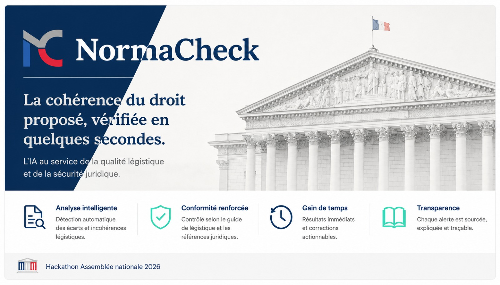

### Nom du défi
NormaCheck — vérificateur de légistique assisté

### Description courte
Collez ou importez un texte législatif (article, amendement, proposition de loi) :
NormaCheck détecte les règles du guide de légistique enfreintes, les explique, propose
des corrections applicables en un clic et calcule un score de conformité sur 100.

### Porteur
Idun-Group

### Description longue
La légistique — l'art de bien rédiger la loi — repose sur un ensemble de règles précises
(typographie, structure des articles, formules standard, références aux textes) réunies
dans le guide pour la rédaction des textes législatifs. Ces règles sont nombreuses,
techniques et faciles à enfreindre par inadvertance ; leur vérification manuelle est
longue et peu fiable.

**NormaCheck** rend cette vérification instantanée. L'utilisateur colle un texte ou
importe un fichier (`.docx`, `.pdf`, `.txt`) ; l'outil surligne les infractions,
explique chaque règle enfreinte et propose une correction applicable en un clic
(unitairement ou globalement, avec « Tout corriger »). Un glossaire consultable réunit
les ~50 règles utilisées, classées par famille — chaque surlignage renvoie vers sa fiche.

**Un moteur hybride en deux couches :**
- **Couche déterministe** (instantanée) : un moteur de règles/regex détecte les
  infractions mécaniques — typographie, structure, formules standard, références — et
  calcule le score de conformité. Le catalogue de règles est la source unique de vérité :
  il alimente à la fois le moteur, le glossaire et le prompt de l'IA.
- **Couche IA locale** (asynchrone) : une analyse plus fine (formulations ambiguës,
  imprécisions, lourdeurs rédactionnelles) est déléguée à la CLI `claude` en local,
  authentifiée via le plan Claude de l'utilisateur — **aucune clé API requise**. Si l'IA
  est indisponible, l'interface l'indique et se rabat proprement sur la seule couche
  déterministe : l'application reste pleinement utilisable.

**Déroulé d'usage :** Saisie → Résultat (texte annoté, surlignages cliquables par
sévérité 🔴 enfreinte · 🟠 à revoir · 🔵 suggestion, score en direct, corrections, export)
→ Glossaire. Le projet est **open source**, testé (135 tests Vitest + parcours Playwright)
et déployé en ligne.

### Image principale

### Contributeurs
- Geoffrey Harrazi

### Ressources utilisées
Cochez les ressources utilisées en remplaçant `[ ]` par `[x]`.

- [ ] `openfisca-france-parameters` — Base de données de paramètres ✺ OpenFisca
- [ ] `an-dossiers-legislatifs` — Dossiers législatifs de l'Assemblée nationale (législature courante) ✺ Assemblée nationale
- [ ] `an-amendements-xvii` — Amendements déposés à l'Assemblée nationale (législature actuelle) ✺ Assemblée nationale
- [ ] `an-comptes-rendus` — Comptes rendus de la séance publique à l'Assemblée nationale (législature actuelle) ✺ Assemblée nationale
- [ ] `an-votes-xvii` — Votes des députés (législature actuelle) ✺ Assemblée nationale
- [ ] `an-deputes-en-exercice` — Députés en exercice ✺ Assemblée nationale
- [ ] `an-deputes-historique` — Historique des députés ✺ Assemblée nationale
- [ ] `an-deputes-senateurs-ministres-par-legislature` — Députés, sénateurs et ministres d'une législature ✺ Assemblée nationale
- [ ] `an-agenda-reunions` — Agenda des réunions à l'Assemblée nationale (législature courante) ✺ Assemblée nationale
- [ ] `an-questions-gouvernement` — Questions de l'Assemblée nationale au Gouvernement ✺ Assemblée nationale
- [ ] `an-questions-gouvernement-ecrites` — Questions écrites de l'Assemblée nationale au Gouvernement ✺ Assemblée nationale
- [ ] `an-questions-gouvernement-orales` — Questions orales de l'Assemblée nationale au Gouvernement ✺ Assemblée nationale
- [ ] `premier-ministre-legi` — Codes, lois et règlements consolidés ✺ Premier ministre
- [ ] `premier-ministre-dole` — Dossiers législatifs Légifrance ✺ Premier ministre
- [ ] `premier-ministre-jorf` — Édition ''Lois et décrets'' du Journal officiel ✺ Premier ministre
- [ ] `senat-dispositifs-textes` — Dispositifs des textes déposés ou adoptés au Sénat ✺ Sénat
- [ ] `senat-dossiers-legislatifs` — Dossiers législatifs du Sénat ✺ Sénat
- [ ] `senat-amendements` — Amendements déposés au Sénat ✺ Sénat
- [ ] `senat-senateurs` — Sénateurs ✺ Sénat
- [ ] `senat-questions-gouvernement` — Questions orales et écrites du Sénat au Gouvernement ✺ Sénat
- [ ] `senat-comptes-rendus` — Comptes rendus de la séance publique au Sénat ✺ Sénat
- [ ] `an-et-co-database-regroupement-toutes-donnees` — Base de données unifiée Parlement / Législation / Service Public ✺ Assemblée nationale & communauté
- [ ] `an-et-co-serveur-mcp-regroupement-toutes-donnees` — Serveur MCP  - Accès unifié Parlement / Législation / Service Public ✺ Assemblée nationale & communauté
- [ ] `an-et-co-api-regroupement-toutes-donnees` — API - Accès unifié Parlement / Législation / Service Public ✺ Assemblée nationale & communauté
- [ ] `legiwatch-api-parlement` — API Parlement ✺ LegiWatch
- [ ] `legiwatch-database-parlement` — Base de données Parlement ✺ LegiWatch
- [ ] `legiwatch-serveur-mcp-parlement` — Serveur MCP Parlement ✺ LegiWatch

> NormaCheck s'appuie sur le **guide de légistique** (règles de rédaction des textes
> législatifs) plutôt que sur les jeux de données ci-dessus : le corpus de règles est
> embarqué dans le code (`lib/rules/`). La couche d'analyse fine utilise la CLI `claude`
> locale, sans clé API ni service externe.

### Galerie
- [Interface principale](images/cover.jpg)

### Documents
- [Présentation NormaCheck (PDF)](docs/presentation-normacheck.pdf)

### URL de démonstration
https://normacheck.idun-group.com/

### Diapositives de présentation
[Diapositives de présentation — NormaCheck (PDF)](docs/presentation-normacheck.pdf)
